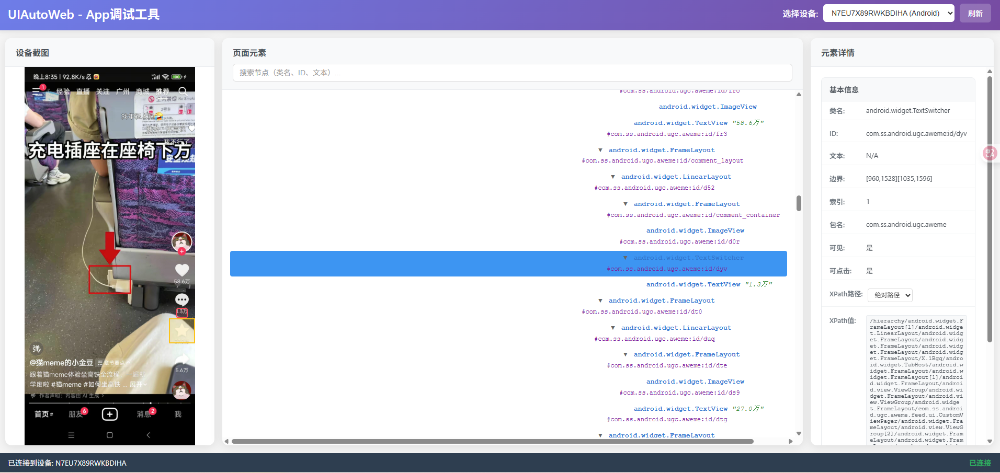

# uiautodev

[](https://codecov.io/gh/codeskyblue/appinspector)
[](https://badge.fury.io/py/uiautodev)

基于 [codeskyblue/uiautodev](https://github.com/codeskyblue/uiautodev) 二次开发，提供本地化WebUI调试页面代替 [https://uiauto.devsleep.com/](https://uiauto.devsleep.com/)

本地化页面地址：http://localhost:20242/

页面截图：



已支持基础的各种定位以及元素基本信息查看。

目前仅测试安卓系统，IOS、鸿蒙系统待测试。

若有 uv 环境可直接使用 uvx 命令运行

```shell
uvx --from https://github.com/dragons96/uiautodev.git uiautodev
```

# Install

```bash
pip install uiautodev
```

To enable Harmony support, run the following command to install its dependencies:

```sh
uiautodev install-harmony
```

# Usage

```bash
Usage: uiauto.dev [OPTIONS] COMMAND [ARGS]...

Options:
  -v, --verbose  verbose mode
  -h, --help     Show this message and exit.

Commands:
  android      COMMAND: tap, tapElement, installApp, currentApp,...
  appium       COMMAND: tap, tapElement, installApp, currentApp,...
  ios          COMMAND: tap, tapElement, installApp, currentApp,...
  self-update  Update uiautodev to latest version
  server       start uiauto.dev local server [Default]
  version      Print version
```

```bash
# run local server and open browser
uiauto.dev
```

# LICENSE

[MIT](LICENSE)

# 更新记录

2025-09-12
1. 支持安卓设备的在线控制 (暂不支持IOS与鸿蒙)

# 其他

如有任何问题欢迎 issue 或联系QQ 521274311

喜欢本项目的话给一个star吧，你的star是我们开发的动力！
